# 環境準備
## ソフトウェアインストール
> [!CAUTION]
> 本勉強会で使用する環境はLinux（Ubuntu等）やMacOSを推奨します。
> - ZeroSpaceではDocker Desktopをインストールする際に管理者権限を求められること
> - Oracle Databaseのコンテナを作成する公式手順がbash利用のため（Windowsでbash利用することは可能だがZeroSpaceでは上記同様に管理者権限を必要とするため）

### Gitクライアント（Windows OS）
https://git-scm.com/download/win からインストールする。
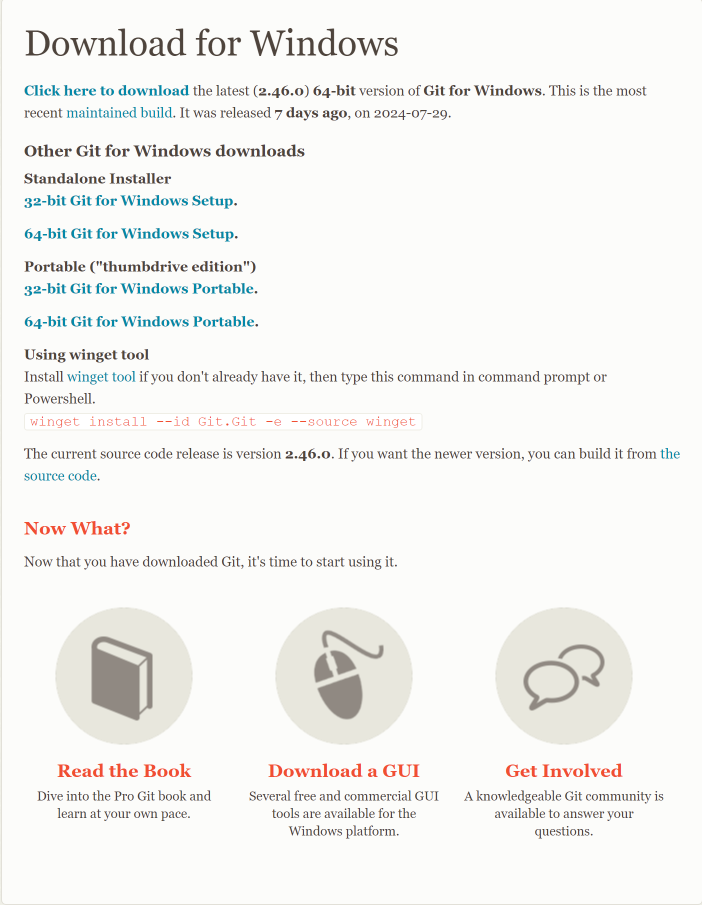
Standalone Installerの64-bit Git for Windows Setupを選択する。

### Gitクライアント（MacOS）
Homebrewを用いて下記コマンドからインストールする。
```
brew install git
```

### Docker Desktop（Windows OS）
https://www.docker.com/ja-jp/products/docker-desktop/ からインストール

### Docker Desktop（MacOS）
Homebrewを用いて下記コマンドからインストールする。
```
brew install --cask docker --force
```

## Oracle Databaseソフトウェアのダウンロード
Gitを用いて下記コマンドからインストールする。
```
git clone https://github.com/oracle/docker-images.git
```

> [!TIP]
> Windowsで`git clone`した際に下記のようなエラーが出る場合があります。

```
git : Cloning into 'docker-images'...
発生場所 行:1 文字:1
+ git clone https://github.com/oracle/docker-images.git
+ ~~~~~~~~~~~~~~~~~~~~~~~~~~~~~~~~~~~~~~~~~~~~~~~~~~~~~
    + CategoryInfo          : NotSpecified: (Cloning into 'docker-images'...:String) [], RemoteException
    + FullyQualifiedErrorId : NativeCommandError
 
fatal: unable to access 'https://github.com/oracle/docker-images.git/': SSL certificate problem: unable to get local issuer certifi
cate
```

その場合、SSLサーバ証明書の検証をOFFにしてから実行します。
```
git config --global http.sslVerify false
git clone https://github.com/oracle/docker-images.git
```

上記コマンドを実行したディレクトリに`docker-images`というディレクトリが作成され、下記のファイルがダウンロードされていれば成功です。
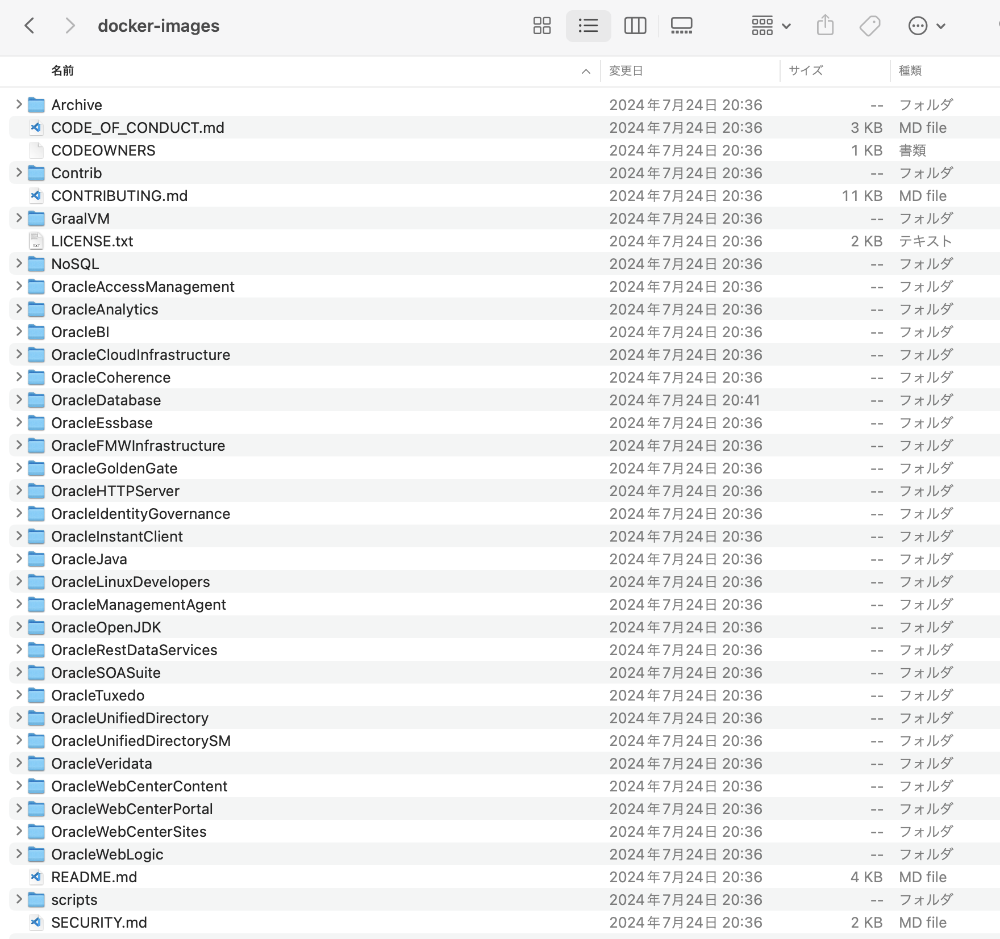

## Oracle Database コンテナイメージの作成
シングルインスタンスのイメージを作成します。
上記`git clone`で取得した資材にはRACなども含まれていますので興味ある方はチャレンジしてみてください。

シングルインスタンスのイメージを作成する資材があるディレクトリへ移動
```
cd ./docker-images/OracleDatabase/SingleInstance/dockerfiles
```

イメージ作成のシェルを実行します。
今回使用するバージョンは`19.3`なので、引数としてバージョンを付与します。
```
./buildContainerImage.sh -v 19.3.0 -e
```

実行後、下記のイメージが作成されていれば完了です。
```
docker images oracle/database
```
```
REPOSITORY        TAG         IMAGE ID       CREATED        SIZE
oracle/database   19.3.0-ee   efd629f521d3   21 hours ago   5.55GB
```

## Oracle Database コンテナの起動
上記のイメージをもとに`docker run`コマンドでコンテナを起動します。
下記例では、接続パスワードを`Password1234`としています。
また、リスナーで使用するポート`1521`とEnterprise Manager（OEM）で使用するポート`5500`をポートフォワードしています。

```
docker run -e ORACLE_PDB=oracle -e ORACLE_PWD=Password1234 -p 1521:1521 -p 5500:5500 oracle/database:19.3.0-ee
```

起動ステータスは下記コマンドにて確認します。
```
docker ps
```
下記のように出力されていることを確認します。
```
CONTAINER ID   IMAGE                       COMMAND                   CREATED      STATUS                            PORTS                                            NAMES
d62a9e199c24   oracle/database:19.3.0-ee   "/bin/bash -c 'exec …"   7 days ago   Up 6 seconds (health: starting)   0.0.0.0:1521->1521/tcp, 0.0.0.0:5500->5500/tcp   crazy_wing
```

> [!TIP]
> Docker Desktopからのコンテナの起動停止ができます。
> 該当コンテナにチェックを入れ、右側にあるActionsのボタン（Start/Stop）をクリック
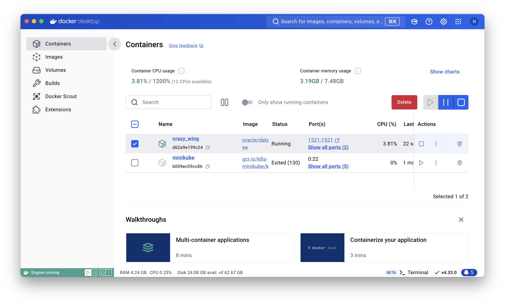


# Oracle Database 操作編
## コンテナへのログイン
前述の`docker ps`またはDocker Desktopで確認した`CONTAINER ID`をもとに下記コマンドでログインします。
```
docker exec -it <CONTAINER ID>> bash
```

## リスナー起動状態の確認
```
lsnrctl status
```
下記のように出力されていれば正常です。
```
Connecting to (DESCRIPTION=(ADDRESS=(PROTOCOL=IPC)(KEY=EXTPROC1)))
STATUS of the LISTENER
------------------------
Alias                     LISTENER
Version                   TNSLSNR for Linux: Version 19.0.0.0.0 - Production
Start Date                13-AUG-2024 05:42:03
Uptime                    0 days 0 hr. 15 min. 13 sec
Trace Level               off
Security                  ON: Local OS Authentication
SNMP                      OFF
Listener Parameter File   /opt/oracle/product/19c/dbhome_1/network/admin/listener.ora
Listener Log File         /opt/oracle/diag/tnslsnr/d62a9e199c24/listener/alert/log.xml
Listening Endpoints Summary...
  (DESCRIPTION=(ADDRESS=(PROTOCOL=ipc)(KEY=EXTPROC1)))
  (DESCRIPTION=(ADDRESS=(PROTOCOL=tcp)(HOST=0.0.0.0)(PORT=1521)))
  (DESCRIPTION=(ADDRESS=(PROTOCOL=tcps)(HOST=d62a9e199c24)(PORT=5500))(Security=(my_wallet_directory=/opt/oracle/admin/ORCLCDB/xdb_wallet))(Presentation=HTTP)(Session=RAW))
Services Summary...
Service "1eede04ae4e21131e063020011ac1bef" has 1 instance(s).
  Instance "ORCLCDB", status READY, has 1 handler(s) for this service...
Service "ORCLCDB" has 1 instance(s).
  Instance "ORCLCDB", status READY, has 1 handler(s) for this service...
Service "ORCLCDBXDB" has 1 instance(s).
  Instance "ORCLCDB", status READY, has 1 handler(s) for this service...
Service "oracle" has 1 instance(s).
  Instance "ORCLCDB", status READY, has 1 handler(s) for this service...
The command completed successfully
```

> [!TIP]
> リスナーが停止している場合、下記のような出力となります。
```
Connecting to (DESCRIPTION=(ADDRESS=(PROTOCOL=IPC)(KEY=EXTPROC1)))
TNS-12541: TNS:no listener
 TNS-12560: TNS:protocol adapter error
  TNS-00511: No listener
   Linux Error: 2: No such file or directory
Connecting to (DESCRIPTION=(ADDRESS=(PROTOCOL=TCP)(HOST=0.0.0.0)(PORT=1521)))
TNS-12541: TNS:no listener
 TNS-12560: TNS:protocol adapter error
  TNS-00511: No listener
   Linux Error: 111: Connection refused
```

### リスナーの概要とOracle Databaseへの接続の仕組み
リスナーはデータベースサーバへの接続要求の受け口となります。
リスナーが起動していないと、OAPやコンテナ基盤からの接続はできません。
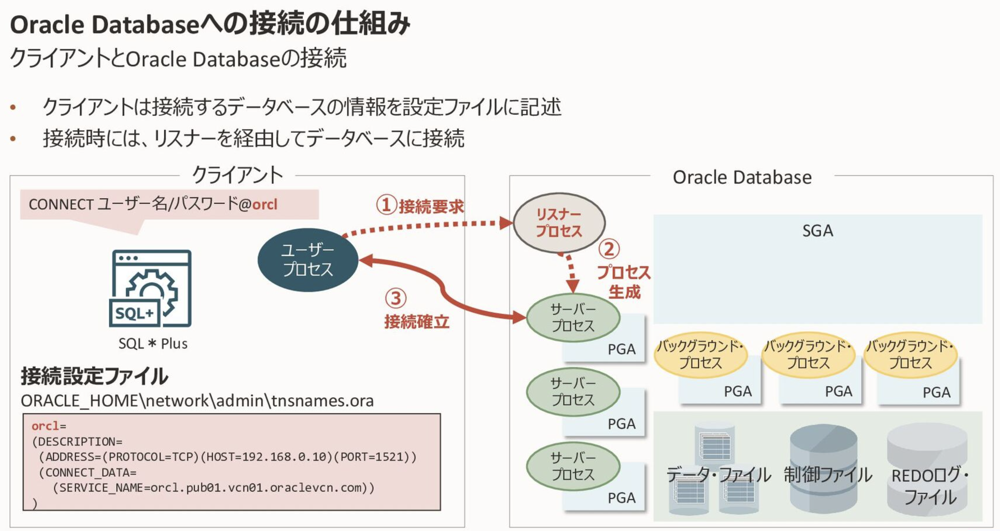
> [!TIP]
> 上記例ではOracle クライアントを用いた接続例となります。
> OAPやコンテナ基盤（BLUE Pod除く）ではクライアント接続となっており、BLUE PodではOracle JDBCドライバによりリスナーへ接続しています。
> 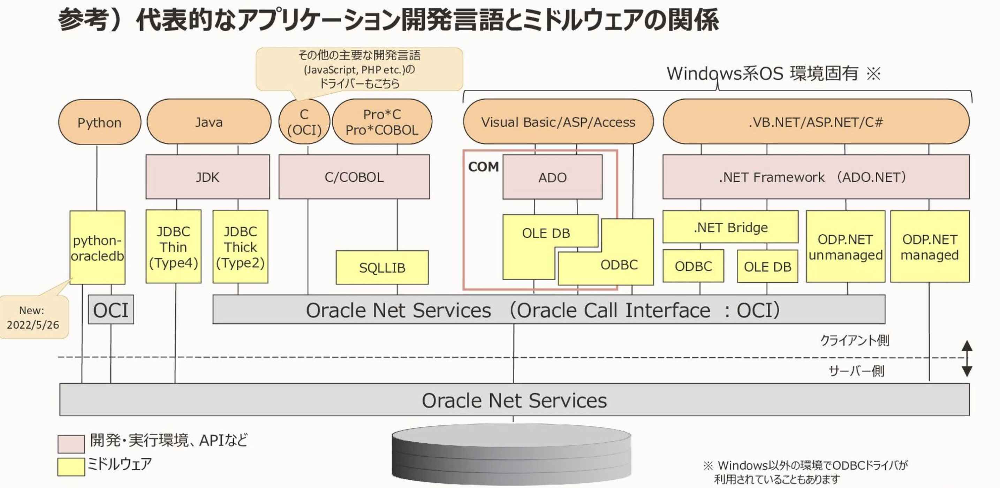

### リスナーの定義情報
リスナーの定義情報は、`${ORACLE_HOME}/network/admin`配下にある`listener.ora`に記載されています。
```
cat $ORACLE_HOME/network/admin/listener.ora 
```
```
LISTENER = 
(DESCRIPTION_LIST = 
  (DESCRIPTION = 
    (ADDRESS = (PROTOCOL = IPC)(KEY = EXTPROC1)) 
    (ADDRESS = (PROTOCOL = TCP)(HOST = 0.0.0.0)(PORT = 1521)) 
  ) 
) 

DEDICATED_THROUGH_BROKER_LISTENER=ON
DIAG_ADR_ENABLED = off
```
コンテナを起動した際に、リスナーポート`1521`をポートフォワードしていますが、ポート設定は上記箇所で設定します。
（リスナーのデフォルトポートは1521となります）

### リスナーの起動停止
リスナーを停止してみましょう。
```
lsnrctl stop LISTENER
```

Oracle Databaseインスタンスへの接続を試みます。
接続には、SQL*Plusというツールを使用します。

```
sqlplus system/Password1234
```
```
SQL*Plus: Release 19.0.0.0.0 - Production on Tue Aug 13 06:24:43 2024
Version 19.19.0.0.0

Copyright (c) 1982, 2023, Oracle.  All rights reserved.

Last Successful login time: Tue Aug 13 2024 06:15:07 +00:00

Connected to:
Oracle Database 19c Enterprise Edition Release 19.0.0.0.0 - Production
Version 19.19.0.0.0
```
ログインできました。リスナーを停止しているのにログインできました。
なぜでしょう。
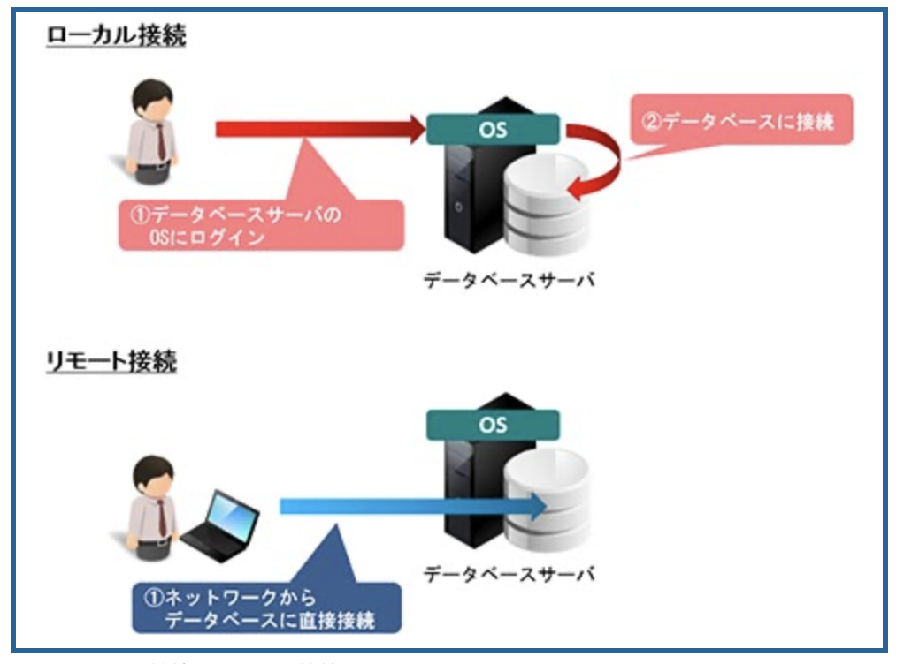
Oracle Databaseへの接続はローカル接続とリモート接続の2種類に分けられ、上記で実施したのはOracle Databaseがあるローカル環境からの接続でありリスナーを使用した接続ではありません。

### リスナー接続を試みる
先ほどのSQL*Plusターミナルからは一度抜けます。
```
SQL> exit
```
SQL*Plusでリスナー接続を試みる場合、`@接続識別子`を付与します。
```
sqlplus system/Password1234@ORCLCDB
```
この場合、下記のようなリスナーが起動していな旨のエラーメッセージが出力されます。
```
ERROR:
ORA-12541: TNS:no listener
```

ここまででリスナーの挙動確認が済んだので、リスナーを起動しておきます。
```
lsnrctl start LISTENER
```

## Oracle Databaseのメモリー
Oracle DatabaseのメモリはSGAとPGAに大別されます。
PGAでは、セッション情報・カーソル情報・ソート領域などに使用されます。
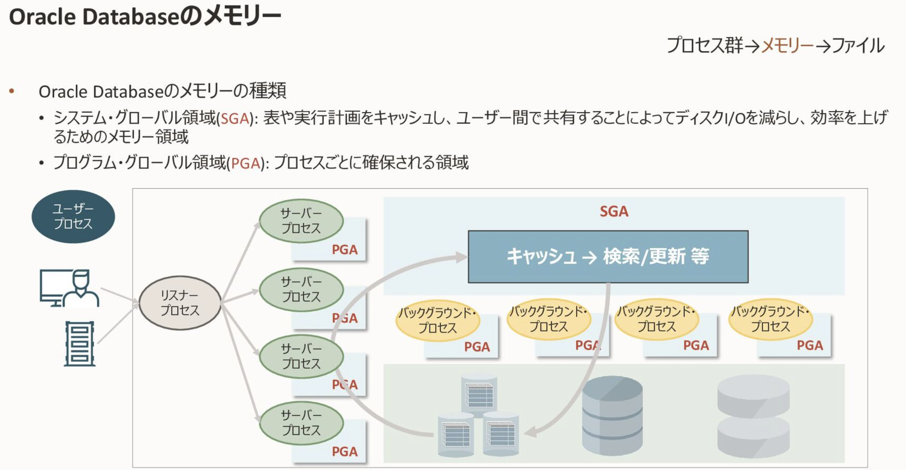

#### SGAの構成要素
SGA（System Global Area）は、Oracleデータベース起動時に確保されるメモリ領域です。

SGAは複数のユーザからの処理要求を効率よく実行するために共有されるメモリ領域で、下記図に示す複数の領域で構成されます。
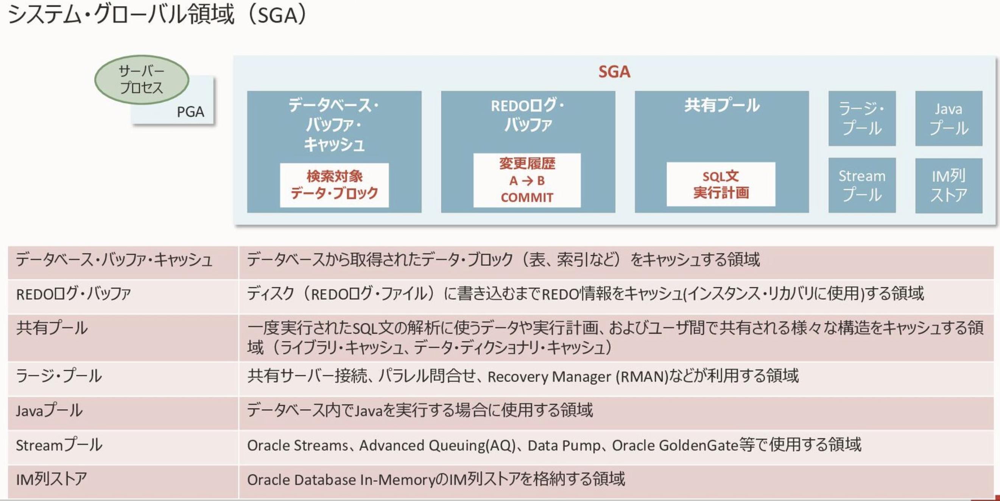

> [!TIP]
> うちのプロジェクトでは、データベース・バッファ・キャッシュや共有プールの割当サイズを注視していることが多いです

#### SGAを調べてみる
Oracle データベースインスタンスに接続します。
起動停止を含むため、`sysdba`権限を付与してログインします。
```
sqlplus system/Password1234 as sysdba
```
```
SQL> SHOW SGA
```
```
Total System Global Area 2466247560 bytes
Fixed Size                  9167752 bytes
Variable Size             620756992 bytes
Database Buffers         1828716544 bytes
Redo Buffers                7606272 bytes
```
```
SQL> SHOW PARAMETER SGA
```
```
NAME                                 TYPE        VALUE
------------------------------------ ----------- ------------------------------
allow_group_access_to_sga            boolean     FALSE
lock_sga                             boolean     FALSE
pre_page_sga                         boolean     TRUE
sga_max_size                         big integer 2352M
sga_min_size                         big integer 0
sga_target                           big integer 2352M
unified_audit_sga_queue_size         integer     1048576
```

Oracle Databaseインスタンス内のSGAでは、`SGA_TARGET`というパラメータで定義したメモリサイズをもとに、各領域のサイズを自動調整してくれます。（個別指定も可）
また、`SGA_MAX_SIZE`というパラメータを用いることでSGAメモリ割り当ての最大値も定義できます。

今回は`SGA_TARGET`と`SGA_MAX_SIZE`の2つのパラメータを変更し、メモリ領域を拡大します。
Oracleの初期化パラメータ変更には、`ALTER SYSTEM文`を用いて変更します。

> [!CAUTION]
> 下記例では4096MBに設定していますが、該当環境のメモリ余剰に応じて設定してください。
```
ALTER SYSTEM SET SGA_MAX_SIZE=4096M SCOPE=SPFILE;
ALTER SYSTEM SET SGA_TARGET=4096M SCOPE=SPFILE;
```

> [!TIP]
> Oracleの初期化パラメータはSPFILEというファイルに定義されています。
> SPFILEはバイナリファイルのため、中身をエディタ等で確認したい場合には下記のようにSPFILEからPFILEを作成することで可読可能となります。
```
SQL> CREATE PFILE FROM SPFILE;
```

2つの初期化パラメータを変更したら、Oracle Databaseインスタンスを再起動します。
```
SQL> SHUTDOWN IMMEDIATE;
```
```
Database closed.
Database dismounted.
ORACLE instance shut down.
```
再びSQL*Plusでログインし起動します。
```
sqlplus system/Password as sysdba
```
```
SQL> STARTUP
```
```
ORACLE instance started.

Total System Global Area 4294965256 bytes
Fixed Size                  9173000 bytes
Variable Size             620756992 bytes
Database Buffers         3657433088 bytes
Redo Buffers                7602176 bytes
Database mounted.
Database opened.
```
> [!IMPORTANT]
> Oracleの起動は SHUTDOWN→NOMOUNT→MOUNT→OPENで遷移します。
>
> NOMOUNT：パラメータを読み込み、バックグラウンドプロセスの起動と共有メモリを確保
> MOUNT：制御ファイル（データベースの構成情報が定義されたファイル）の読み込み
> OPEN：データファイルやREDOログファイルのチェックを行う
>
> OPEN状態にならないとデータベースは正常な処理ができません。
> 
> データベースの起動に失敗する場合、上記のどの状態となっているかで原因箇所の特定や対処が変わりますので覚えておきましょう。
> 
SGAを確認してみます。
```
SQL> SHOW SGA
```
SGAのサイズが拡張されていることが確認できます。
```
Total System Global Area 4294965256 bytes
Fixed Size                  9173000 bytes
Variable Size             620756992 bytes
Database Buffers         3657433088 bytes
Redo Buffers                7602176 bytes
```

## SQLに触れてみる
### Oracle公式のサンプルデータをダウンロード
ローカル端末にて、公式GitHubからサンプルデータをgit cloneします。
```
https://github.com/oracle-samples/db-sample-schemas.git
```
今回は`HR`のデータを使用します。該当のディレクトリまで移動します。
```
cd ./db-sample-schemas/human_resources
```

下記に示す5つのSQLファイルをコンテナへコピーします。
```
docker cp hr_install.sql $CONTAINER_ID:/home/oracle/hr_install.sql
docker cp hr_code.sql $CONTAINER_ID:/home/oracle/hr_code.sql
docker cp hr_create.sql $CONTAINER_ID:/home/oracle/hr_create.sql
docker cp hr_populate.sql $CONTAINER_ID:/home/oracle/hr_populate.sql
docker cp hr_uninstall.sql $CONTAINER_ID:/home/oracle/hr_uninstall.sql
```

Oracleデータベースへ接続します。
```
sqlplus system/Password as sysdba
```

CDBではなくPDBに対して実行します。
（CDBに対してユーザ作成はNGのため）

```
SQL> ALTER SESSION SET CONTAINER = ORACLE;
```
> [!TIP]
> 今接続しているコンテナ名を調べるには`SQL> SHOW CON_NAME;`
> 
> PDBを調べるには`SQL> SELECT PDB_NAME FROM CDB_PDBS;`

### サンプルデータ作成資材の実行
```
SQL> @hr_install.sql
```
`hr`ユーザのパスワードは好きに設定してください。表領域はデフォルトの`USERS`でOKです。
> [!TIP]
> SQLファイルを実行する場合、ファイル名の前段に`@`を付与します。

### 作成したhrユーザでログイン
```
sqlplus hr/Password1234@ORACLE
```

作成したテーブル`EMPLOYEES`の定義情報を調べてみましょう。
```
SQL> DESC EMPLOYEES
```
下記のようなカラム定義が出力されます。
```
 Name                                      Null?    Type
 ----------------------------------------- -------- ----------------------------
 EMPLOYEE_ID                               NOT NULL NUMBER(6)
 FIRST_NAME                                         VARCHAR2(20)
 LAST_NAME                                 NOT NULL VARCHAR2(25)
 EMAIL                                     NOT NULL VARCHAR2(25)
 PHONE_NUMBER                                       VARCHAR2(20)
 HIRE_DATE                                 NOT NULL DATE
 JOB_ID                                    NOT NULL VARCHAR2(10)
 SALARY                                             NUMBER(8,2)
 COMMISSION_PCT                                     NUMBER(2,2)
 MANAGER_ID                                         NUMBER(6)
 DEPARTMENT_ID                                      NUMBER(4)
 ```

> [!NOTE]
> 以下の情報を抽出してみましょう。
> - EMPLOYEESテーブルの件数は何件ありますか。
> - SALARYが最も高い従業員のEMPLOYEE_ID,FIRST_NAME,LAST_NAME,SALARYは何でしょう。
> - 部署（DEPARTMENT_ID)ごとSALARY合計額を調べてみましょう。
  

## Enterprise Managerを触ってみる
### Enterprise Managerとは
- オンプレミスとクラウドのトップレベルビューから、Oracle Database全体をモニタリングおよび管理できる
- 自動化され統合された、強力な組み込み診断を提供
- 自動データベース診断モニター（ADDM） - Oracle Databaseカーネルに組み込むことで、パフォーマンスの問題を簡単に特定
- 自動ワークロード・リポジトリ（AWR）およびアクティブ・セッション履歴（ASH）によってデータベース・パフォーマンス・データを自動的に収集および分析
- データベース・インスタンスおよびホスト・オペレーティング・システムのモニターと、アラートや通知の発行
- SQLチューニング・アドバイザがSQLチューニングの包括的な推奨事項を自動で提供
- SQLアクセス・アドバイザが最適なパフォーマンスを発揮する構造を推奨

### Enterprise Managerへのログイン
ローカル環境でブラウザを起動します。
```
https://localhost:5500/em
```
ユーザ名：system、パスワード：コンテナ起動時に設定したパスワード（本勉強会ではPassword1234）を入力します。コンテナ名は空欄でOKです。
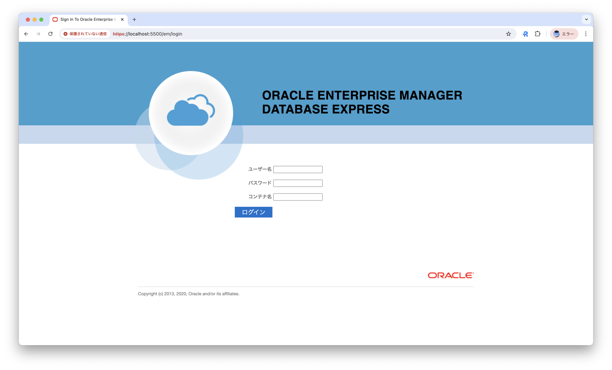

ログイン後、下記のトップ画面が表示されます。
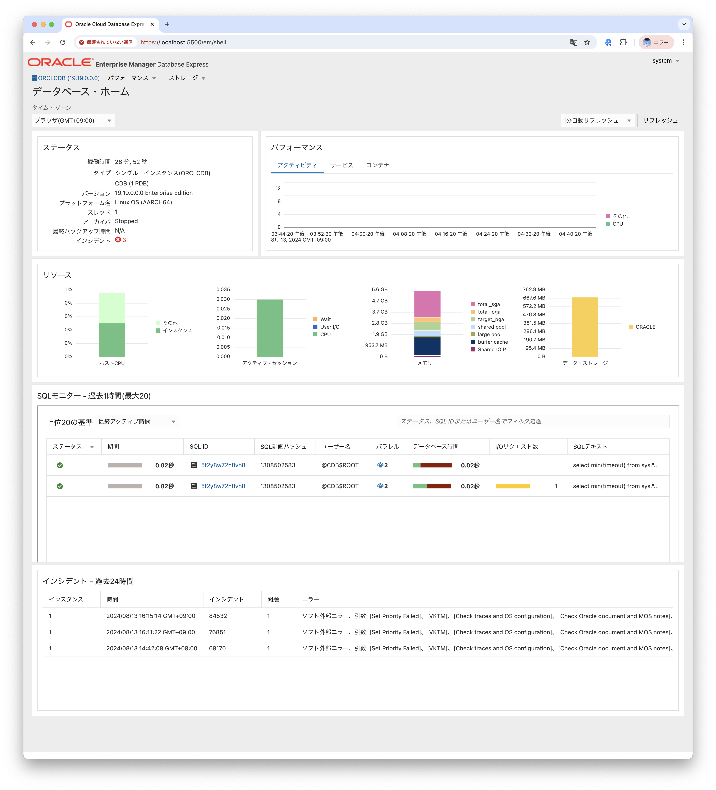

ASHの詳細や問題のあるSQLの分析が可能です。（負荷をかけていないのでリストには上がらないと思います）
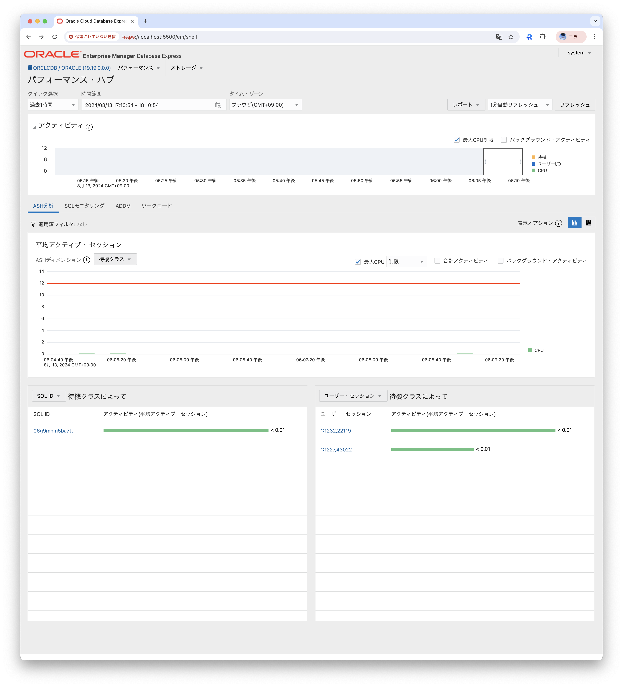
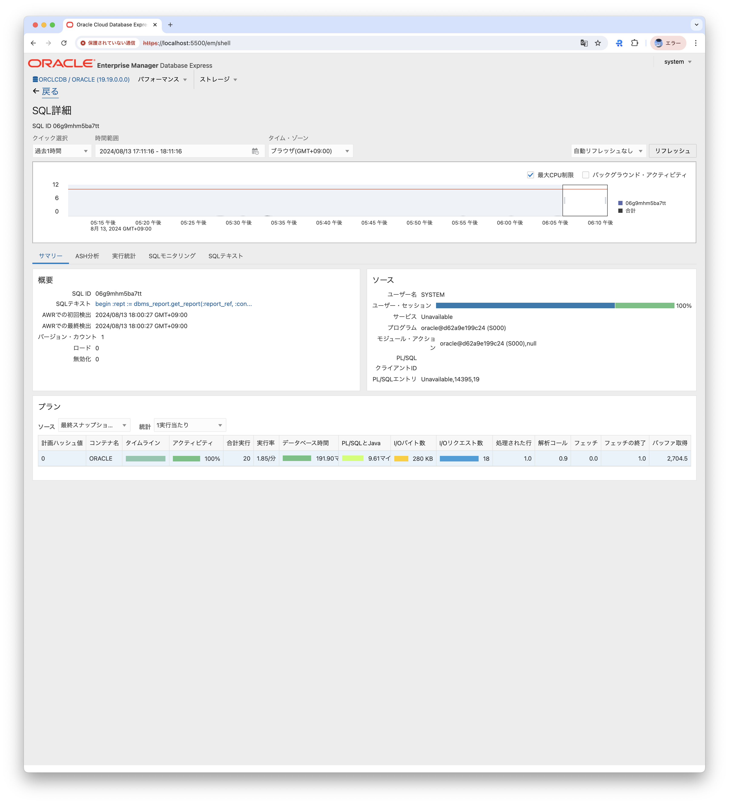

## AWRの取得
### AWRとは何か
データベースのパフォーマンス診断のための統計情報リポジトリ。
Automatic Workload Repositoryの略で、Databaseno稼働統計とワークロード情報のスナップショットを自動的に収集し管理する機能です。
デフォルトでは60分毎に収集し、8日間保存されます。

### AWRの仕組み
ある２つの時点で取得したデータの差分をもとに、その間のパフォーマンス統計のデータをレポートに出力します。
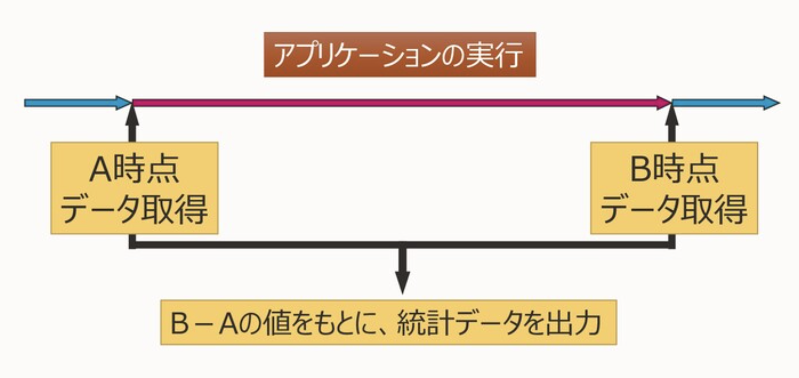

### 統計情報の取得レベル
- ALL：追加の統計収集のためのオーバーヘッドがあるため、トラブルシューティングなど限定的な利用
- TYPICAL（デフォルト）：ほとんどの環境に適している
- BASIC：アドバイザなどの多くの機能が無効となるため推奨されていない

### スナップショットを実行
取得レベルを`TYPICAL`としてスナップショットを実行します。
```
SQL> EXECUTE DBMS_WORKLOAD_REPOSITORY.CREATE_SNAPSHOT('TYPICAL');
```
下記のメッセージが出力されれば正常に実行できています。
```
PL/SQL procedure successfully completed.
```

HRユーザで再度ログインし、先ほどのSQLを実行してみます。
```
sqlplus hr/Password1234@ORACLE
```

```
SQL> SELECT COUNT(*) FROM EMPLOYEES;
SQL> SELECT EMPLOYEE_ID,FIRST_NAME,LAST_NAME,SALARY FROM EMPLOYEES WHERE SALARY = (SELECT MAX(SALARY) FROM EMPLOYEES);
SQL> SELECT DEPARTMENT_ID,SUM(SALARY) FROM EMPLOYEES GROUP BY DEPARTMENT_ID ORDER BY DEPARTMENT_ID;
```

SQL*Plusにsystemユーザで再度ログインし、スナップショットを実行します。
```
sqlplus system/Password1234 as sysdba
```
```
SQL> EXECUTE DBMS_WORKLOAD_REPOSITORY.CREATE_SNAPSHOT('TYPICAL');
```
ここまでで、AWRの取得に向けたBEGIN/ENDのスナップショット取得が完了です。

### AWRの取得
AWRを手動で取得するためのスクリプトが標準で用意されています。
systemユーザでAWR取得の資材を実行します
```
SQL> @$ORACLE_HOME/rdbms/admin/awrrpt.sql
```
- 出力されるレポート形式を聞かれます。今回は`html`を選択。
- 次に、スナップショットの取得日を聞かれます。今回は`1`を選択。
- 次に、比較元のスナップショットIDを聞かれます。1回目の取得日時に該当するSnap Idを選択。
- 次に、比較先のスナップショットIDを聞かれます。2回目の取得日時に該当するSnap Idを選択。
- 最後に、AWRの生成ファイル名を聞かれます。好きな名前を設定します。ここでは`awr_sample.html`とします。

### AWRの転送
ローカル環境のブラウザで見れるよう、上記で取得したhtmlファイルをローカル環境へ転送します。
コンテナ環境からは`exit`で抜け、ローカル環境で以下を実行します。
```
docker cp $CONTAINER_ID:/home/oracle/awr_sample.html awr_sample.html 
```

ローカル環境へコピーしたAWRファイルを開くと下記のようなレポートが表示されます。
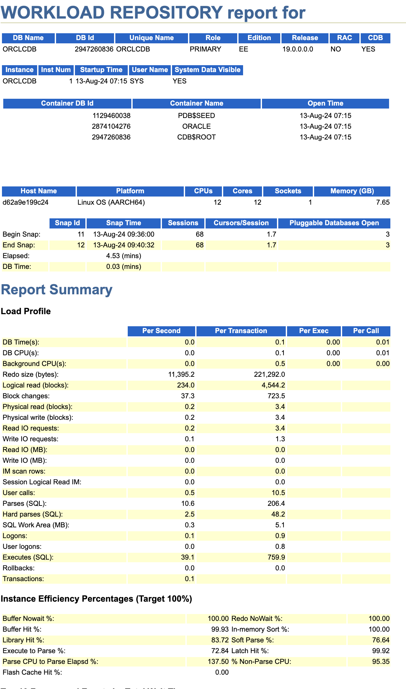

> [!NOTE]
> - 先ほど実行した３つのSQLの記載はありますか